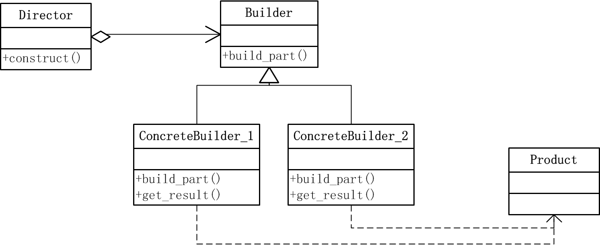
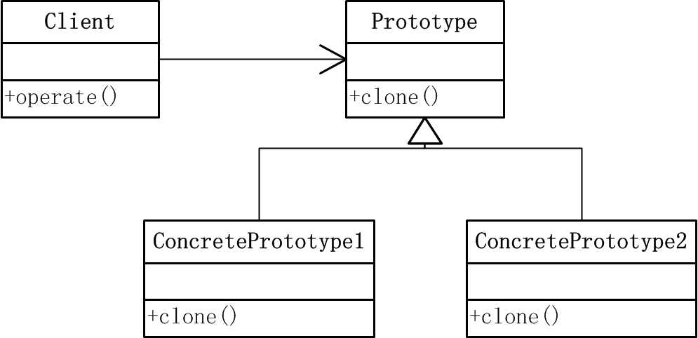

# 设计模式：Python语言实现之创建型模式

## simple factory 模式

### 定义
简单工厂模式是属于创建型模式，又叫做静态工厂方法（Static Factory Method）模式，是由一个工厂对象决定创建出哪一种产品类的实例。

### 结构

### 参与者
- 抽象产品（Product）：所创建产品的父类，用于描述所有实例具有的公共接口
- 具体产品（ConcreteProduct）：所创建产品的具体类，实现公共接口，产生具体实例。
- 简单工厂（SimpleFactory）：负责实现创建实例的内部逻辑逻辑，直接被外部调用，创建所需产品对象

### 代码实现
- 抽象产品（`product.py`）
 
	    class Product(object):
            """a base class to define common interfaces"""
            def operate(self):
                pass

- 具体产品（`concrete_product_1.py` & `concrete_product_2.py`）

	    from product import *
        class ConcreteProduct_1(Product):
            """a concrete product class to implement common interfaces"""
            def operate(self):
                print "operation implemented by ConcreteProduct_1"
	
	    from product import *
        class ConcreteProduct_2(Product):
            """a concrete product class to implement common interfaces"""
            def operate(self):
                print "operation implemented by ConcreteProduct_2"

- 简单工厂（`simple_factory.py`）

        from concrete_product_1 import *
        from concrete_product_2 import *

        class SimpleFactory(object):
            """SimpleFactory to create concrete pruduct"""
            def create(self,option):
                if option == "product 1":
                    return ConcreteProduct_1()
                elif option == "product 2":
                    return ConcreteProduct_2()
                else: 
                    return None

- 客户端使用示例（`use_sim_fac.py`）

        from simple_factory import SimpleFactory

        fac = SimpleFactory()
        product = fac.create("product 2")
        if product != None:
            product.operate()

### 优缺点

- 优点：简单工厂模式中，工厂类实现逻辑，根据外界信息决定创建哪个具体类的实例，避免客户端程序直接创建具体实例。
- 缺点：工厂类是该模式的核心，承担了太重要的角色，工厂类能够正常工作影响全部逻辑。此外，如需增加和扩展业务时需更改工厂类，违反开放-封闭的原则。

--------------------------------------------------------------------------------

## factory method 模式

### 定义
工厂方法模式又叫做虚构造器，它定义一个用于创建对象的接口，让子类决定实例化哪一个对象。该模式使一个类的实例化延迟到其子类。

### 结构

### 参与者
- 抽象产品（Product）：所创建产品的父类，用于描述所有实例具有的公共接口
- 具体产品（ConcreteProduct）：所创建产品的具体类，实现公共接口，产生具体实例。
- 抽象创建者（Creator）：声明工厂方法，返回Product类型对象。
- 具体创建者（ConcreteCreator）：定义具体工厂方法，返回具体ConcreteProduct实例。

### 代码实现
- 产品类 （`product.py`）

        #  abstract product
        class Product(object):
            """a base class to define common interfaces"""
            def operate(self):
                pass

        # concrete product
        class ConcreteProduct_1(Product):
            """a concrete product class to implement common interfaces"""
            def operate(self):
                print "operation implemented by ConcreteProduct_1"

        class ConcreteProduct_2(Product):
            """a concrete product class to implement common interfaces"""
            def operate(self):
                print "operation implemented by ConcreteProduct_2"

- 创建者类 （`creator.py`）
        
        from product import *

        # abstract creator
        class Creator(object):
            """a base creator to define factory method"""
            def create(self):
                pass

        # concrete creator
        class ConcreteCreator_1(Creator):
            """ a concrete creator to implement factory method"""
            def create(self):
                return ConcreteProduct_1()

        class ConcreteCreator_2(Creator):
            """ a concrete creator to implement factory method"""
            def create(self):
                return ConcreteProduct_2()

- 客户端 （`client.py`）

        import random
        from product import *
        from creator import *

        # choice concrete creator manually
        mycreator = ConcreteCreator_1()
        myproduct = mycreator.create()
        myproduct.operate()

        # choice concrete creator randomly
        def genefac(n):
            for i in range(n):
                yield random.choice(Creator.__subclasses__())

        mycreators = [i() for i in genefac(10)]
        myproducts = [i.create() for i in mycreators]

        for i in myproducts:
            i.operate()

### 优缺点
- 优点：工厂方法模式将简单工厂中工厂类的逻辑交由客户端，客户端选择具体工厂类进行具体产品的实例化，当增加新的产品时，不需要更改抽象工厂类，只需实现新的具体工厂类即可，封装性和可扩展性好
- 缺点：当应用本身逻辑简单时，相对于简单工厂方法，其编码较多，额外开销大。

--------------------------------------------------------------------------------

## abstract factory 模式

### 定义
抽象工厂模式，又叫kit模式，提供一个创建一系列相关或相互依赖对象的接口，而无需指定它们具体的类。适用于具有多个产品系列的应用情况。

### 结构

### 参与者
- 抽象工厂（AbstractFactory）：声明一个创建抽象对象产品的操作接口。
- 具体工厂（ConcreteFactory）: 实现创建具体产品对象的操作
- 抽象产品（AbstractProduct）：为一类产品对象声明接口
- 具体产品（ConcreteProduct）：定义一个将被相应工厂创建的产品对象，实现抽象产品接口
- 客户端（Client）：仅使用由抽象工厂和抽象产品声明的接口。

### 代码实现
- 产品类(`product.py`)

        # abstract product A

        class AbstractProductA(object):
            def operate(self):
                pass

        # concrete product A

        class ConcreteProductA1(AbstractProductA):
            def operate(self):
                print "operate by ConcreteProductA1"

        class ConcreteProductA2(AbstractProductA):
            def operate(self):
                print "operate by ConcreteProductA2"

        # abstract product B

        class AbstractProductB(object):
            def operate(self):
                pass

        # concrete product B

        class ConcreteProductB1(AbstractProductB):
            def operate(self):
                print "operate by ConcreteProductB1"

        class ConcreteProductB2(AbstractProductB):
            def operate(self):
                print "operate by ConcreteProductB2"

- 工厂类(`factory.py`)

        from product import *

        # abstract factory

        class AbstractFactory(object):
            def create_product_a(self):
                pass
            def create_product_b(self):
                pass

        # concrete factory

        class ConcreteFactory1(AbstractFactory):
            def create_product_a(self):
                return ConcreteProductA1()
            def create_product_b(self):
                return ConcreteProductB1()

        class ConcreteFactory2(AbstractFactory):
            def create_product_a(self):
                return ConcreteProductA2()
            def create_product_b(self):
                return ConcreteProductB2()

- 客户端(`client.py`)

        import random
        from product import *
        from factory import *

        # choice concrete factory manually
        fac = ConcreteFactory1()
        prod = fac.create_product_a()
        prod.operate()

        # choice concrete factory randomly
        def genfac(n):
            for i in range(n):
                yield random.choice(AbstractFactory.__subclasses__())

        facs = [i() for i in genfac(10)]

        prods = []
        [prods.extend([i.create_product_a(), i.create_product_b()]) for i in facs]

        for i in prods:
            i.operate()

### 优缺点
- 优点：该模式方便改变产品系列，只改变具体工厂就可以配置不同的产品系列。
- 缺点：使用该模式增加新的产品时，由于抽象工厂定义了所有可生产产品的集合，因此需要更改所有工厂类以实现增加产品的目的，开销较大。

-------------------------------------------------------------------------------

## builder 模式

### 定义
生成器模式将一个复杂对象的创建过程与它的表示分离，使得同样的创建过程可以创建不同的表示。

### 结构

### 参与者
- 具体产品（Product）：被构造的具体产品，定义组成部件的类，由ConcreteBuilder调用接口进行具体装配。
- 抽象生成器（Builder）：为创建具体产品对象的各个部件指定抽象接口。
- 具体生成器（ConcreteBuilder）：定义抽象生成器的创建部件的接口，并提供一个检索具体产品的接口。
- 指挥者（Director）：构建使用生成器接口的对象，定义构建的标准流程。

### 代码实现
- 产品类(`product.py`)

        class Product(object):
            def __init__(self):
                self.parts = "I hava these parts: "

            def add(self, part):
                self.parts += part

            def show(self):
                print self.parts

- 生成器类（`builder.py`）

        from product import *

        # abstract builder
        class Builder(object):
            def build_part_a(self):
                pass
            def build_part_b(self):
                pass

        # concrete builder
        class ConcreteBuilder1(Builder):
            def __init__(self):
                self.product = Product()

            def build_part_a(self):
                self.product.add("1_part_a, ")

            def build_part_b(self):
                self.product.add("1_part_b, ")

            def get_result(self):
                return self.product

        class ConcreteBuilder2(Builder):
            def __init__(self):
                self.product = Product()

            def build_part_a(self):
                self.product.add("2_part_a, ")

            def build_part_b(self):
                self.product.add("2_part_b, ")

            def get_result(self):
                return self.product

- 指挥者类(`director.py`)

        from builder import *

        class Director(object):
            def construct(self, builder):
                builder.build_part_a()
                builder.build_part_b()

- 客户端(`client.py`)

        from builder import *
        from director import *

        mydirector = Director()
        mybuilder1 = ConcreteBuilder1()
        mybuilder2 = ConcreteBuilder2()

        mydirector.construct(mybuilder1)
        mydirector.construct(mybuilder2)

        prod1 = mybuilder1.get_result()
        prod2 = mybuilder2.get_result()

        prod1.show()
        prod2.show()

### 适用性
该模式适用于当创建复杂对象的算法应该独立于该对象的组成部分以及它们的装配方式时，且允许被构造的对象有不同的表示时。它可以使构造代码与表示代码分离，通过传递不同的生成器可以改变不同的表示。相比于抽象工厂模式，二者均可建立复杂的产品对象，但侧重点不同，生成器模式侧重一步一步构造复杂产品，而抽象工厂则侧重多个系列产品（复杂或是简单的）对象的构造。

-------------------------------------------------------------------------------

## prototype 模式

### 定义
用原型实例指定创建对象的种类，并且通过拷贝这些原型创建新的对象。

### 结构

### 参与者
- 抽象原型（Prototype）：声明一个克隆自身的接口。
- 具体原型（ConcretePrototype）：实现克隆自身的操作。
- 客户端（Client）：让一个原型克隆自身返回一个新的对象。

### 代码实现

- 原型类（`prototype.py`）

        import copy

        # abstract prototype
        class Prototype(object):
            def clone(self):
                pass

        # concrete prototype
        class ConcretePrototype1(Prototype):
            def clone(self):
                return copy.copy(self)

        class ConcretePrototype2(Prototype):
            def clone(self):
                return copy.copy(self)

- 客户端（`client.py`）

        from prototype import *

        p1 = ConcretePrototype1()
        c1 = p1.clone()

### 适用性
该模式的优点在于可以从一个对象再创建另外一个可以定制的对象，且不需要知道具体的创建过程。可以实现运行时刻指定实例化类，此外还具有比手动创建所有实例更方便的优点。

--------------------------------------------------------------------------------

## singleton 模式

### 定义
保证一个类仅有一个实例，并提供一个访问它的全局访问点。

### 结构

### 参与者
- 单例类（Singleton）：定义一个get_instance方法，允许客户端访问它的唯一实例。

### 代码实现
- 单例类（`singleton.py`）

        class Singleton(object):
            instance = None

            def __init__(self):
                pass

            @staticmethod
            def get_instance():
                if Singleton.instance is None:
                    Singleton.instance = Singleton()

                return Singleton.instance

- 客户端（`client.py`）

        from singleton import *

        s1 = Singleton.get_instance()
        s2 = Singleton.get_instance()

        if s1 is s2:
            print "in singleton pattern"

### 适用性
单例模式保证了类只有一个实例，且可以从一个众所周知的访问点访问它。

--------------------------------------------------------------------

### 参考
- [设计模式-可复用面向对象软件的基础](http://book.douban.com/subject/1052241/) 
- [大话设计模式](http://book.douban.com/subject/2334288/)
- [Thinking in python](http://docs.linuxtone.org/ebooks/Python/Thinking_In_Python.pdf)