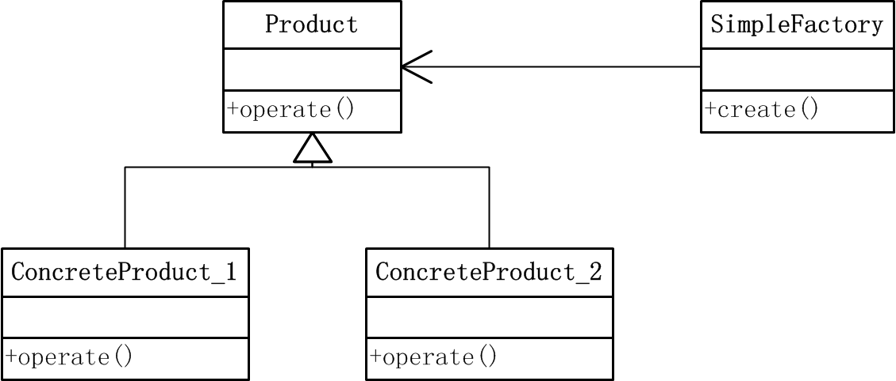

# 设计模式：Python语言实现之创建型模式

## simple factory 模式

### 定义
简单工厂模式是属于创建型模式，又叫做静态工厂方法（Static Factory Method）模式，是由一个工厂对象决定创建出哪一种产品类的实例。

### 结构

### 参与者
- 抽象产品（Product）：所创建产品的父类，用于描述所有实例具有的公共接口
- 具体产品（ConcretProduct）：所创建产品的具体类，实现公共接口，产生具体实例。
- 简单工厂（SimpleFactory）：负责实现创建实例的内部逻辑逻辑，直接被外部调用，创建所需产品对象

### 代码实现
- 抽象产品（`product.py`）
 
	    class Product(object):
            """a base class to define common interfaces"""
            def operate(self):
                pass

- 具体产品（`concret_product_1.py` & `concret_product_2.py`）

	    from product import *
        class ConcretProduct_1(Product):
            """a concret product class to implement common interfaces"""
            def operate(self):
                print "operation implemented by ConcretProduct_1"
	
	    from product import *
        class ConcretProduct_2(Product):
            """a concret product class to implement common interfaces"""
            def operate(self):
                print "operation implemented by ConcretProduct_2"

- 简单工厂（`simple_factory.py`）

        from concret_product_1 import *
        from concret_product_2 import *

        class SimpleFactory(object):
            """SimpleFactory to create concret pruduct"""
            def create(self,option):
                if option == "product 1":
                    return ConcretProduct_1()
                elif option == "product 2":
                    return ConcretProduct_2()
                else: 
                    return None

- 客户端使用示例（`use_sim_fac.py`）

        from simple_factory import SimpleFactory

        fac = SimpleFactory()
        product = fac.create("product 2")
        if product != None:
            product.operate()

### 优缺点

- 优点：简单工厂模式中，工厂类实现逻辑，根据外界信息决定创建哪个具体类的实例，避免客户端程序直接创建具体实例。
- 缺点：工厂类是该模式的核心，承担了太重要的角色，工厂类能够正常工作影响全部逻辑。此外，如需增加和扩展业务时需更改工厂类，违反开放-封闭的原则。

--------------------------------------------------------------------------------

## factory method 模式

### 定义
工厂方法模式又叫做虚构造器，它定义一个用于创建对象的接口，让子类决定实例化哪一个对象。该模式使一个类的实例化延迟到其子类。

### 结构

### 参与者
- 抽象产品（Product）：所创建产品的父类，用于描述所有实例具有的公共接口
- 具体产品（ConcretProduct）：所创建产品的具体类，实现公共接口，产生具体实例。
- 抽象创建者（Creator）：声明工厂方法，返回Product类型对象。
- 具体创建者（ConcretCreator）：定义具体工厂方法，返回具体ConcretProduct实例。

### 代码实现
- 产品类 （`product.py`）

        #  abstract product
        class Product(object):
            """a base class to define common interfaces"""
            def operate(self):
                pass

        # concret product
        class ConcretProduct_1(Product):
            """a concret product class to implement common interfaces"""
            def operate(self):
                print "operation implemented by ConcretProduct_1"

        class ConcretProduct_2(Product):
            """a concret product class to implement common interfaces"""
            def operate(self):
                print "operation implemented by ConcretProduct_2"

- 创建者类 （`creator.py`）
        
        from product import *

        # abstract creator
        class Creator(object):
            """a base creator to define factory method"""
            def create(self):
                pass

        # concret creator
        class ConcreteCreator_1(Creator):
            """ a concret creator to implement factory method"""
            def create(self):
                return ConcretProduct_1()

        class ConcreteCreator_2(Creator):
            """ a concret creator to implement factory method"""
            def create(self):
                return ConcretProduct_2()

- 客户端 （`client.py`）

        import random
        from product import *
        from creator import *

        # choice concrete creator manually
        mycreator = ConcreteCreator_1()
        myproduct = mycreator.create()
        myproduct.operate()

        # choice concrete creator randomly
        def genefac(n):
            for i in range(n):
                yield random.choice(Creator.__subclasses__())

        mycreators = [i() for i in genefac(10)]
        myproducts = [i.create() for i in mycreators]

        for i in myproducts:
            i.operate()

### 优缺点
- 优点：工厂方法模式将简单工厂中工厂类的逻辑交由客户端，客户端选择具体工厂类进行具体产品的实例化，当增加新的产品时，不需要更改抽象工厂类，只需实现新的具体工厂类即可，封装性和可扩展性好
- 缺点：当应用本身逻辑简单时，相对于简单工厂方法，其编码较多，额外开销大。